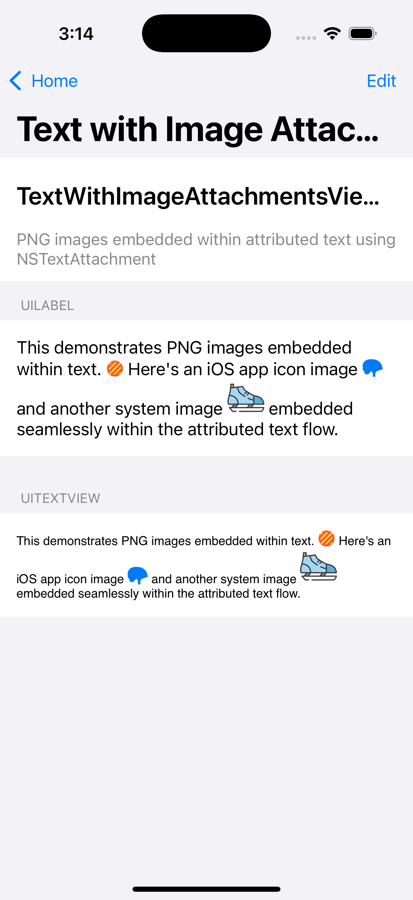
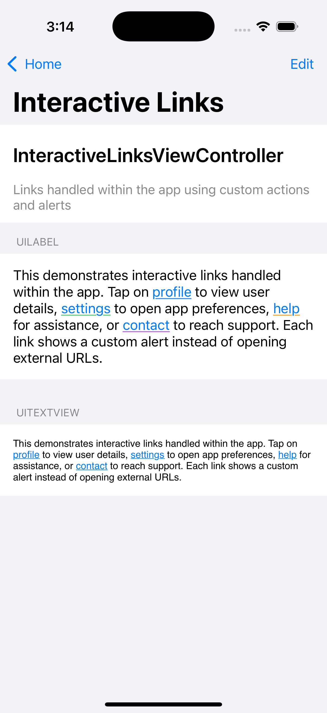
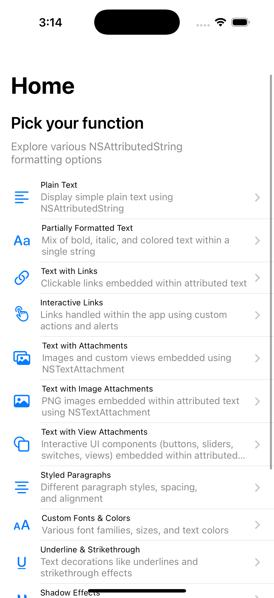

# NSAttributedString Demo


A comprehensive iOS demo application showcasing the power and versatility of `NSAttributedString` for rich text formatting and interactive text elements.

## Overview

This demo application demonstrates various text formatting capabilities available in iOS using `NSAttributedString`. From basic text styling to complex interactive elements embedded within text, this project serves as a complete reference for iOS developers working with rich text.

## Features

### 📝 Text Formatting
- **Plain Text**: Basic NSAttributedString usage
- **Partially Formatted Text**: Mixed text styles within a single string
- **Custom Fonts & Colors**: Different font families, sizes, and color schemes
- **Text Decorations**: Underlines, strikethrough effects, and combinations
- **Background Colors**: Text highlighting with various background colors
- **Shadow Effects**: Drop shadows with different blur radii and offsets
- **Styled Paragraphs**: Text alignment, spacing, and paragraph formatting
- **Advanced Formatting**: Complex multi-attribute text combinations

### 🔗 Interactive Elements
- **Text with Links**: Clickable URLs with custom styling
- **Interactive Links**: Advanced link handling with custom actions
- **Text Attachments**: Embedded images and SF Symbols
- **Image Attachments**: PNG images seamlessly integrated into text
- **View Attachments**: Interactive UI elements embedded in text including:
  - Colored views and custom shapes
  - Progress bars and activity indicators
  - Interactive buttons with tap handling
  - Sliders with value change callbacks
  - Toggle switches with state management

### 🎯 Advanced Features
- **Interactive UI Components**: Fully functional buttons, sliders, and switches within text
- **Custom Text Attachments**: Sophisticated view embedding system
- **Real-time Interaction**: Live updates and callbacks from embedded elements
- **Professional Layout**: Proper positioning and alignment of embedded views

## Screenshots

### Main Interface

*Main menu showing all available text formatting demos*

### Text Formatting Examples

*Various text formatting options including fonts, colors, and decorations*

### Interactive Elements

*Interactive UI elements embedded within attributed text*

## Architecture

### Core Components

- **BaseDetailViewController**: Base class for all demo screens with common functionality
- **HomeViewModel**: Data model for organizing demo categories
- **GKSubviewAttachingTextView**: Custom UITextView subclass for embedding interactive views
- **GKSubviewTextAttachment**: Advanced NSTextAttachment for view embedding
- **GKSubviewAttachingTextViewBehavior**: Layout management system for embedded views

### Key Technologies

- **NSAttributedString**: Core text formatting and attribute management
- **NSTextAttachment**: Embedding non-text elements in text
- **UITextView**: Advanced text display and interaction
- **Core Graphics**: Custom drawing and rendering
- **Auto Layout**: Responsive UI design

## Requirements

- iOS 16.0+
- Xcode 15.0+
- Swift 5.9+ (for mixed language support)

## Usage

Each demo screen showcases different aspects of NSAttributedString:

1. **Basic Formatting**: Learn fundamental text styling techniques
2. **Advanced Styling**: Explore complex formatting combinations
3. **Interactive Elements**: Discover how to embed functional UI elements
4. **Real-world Applications**: See practical implementations

### Code Examples

#### Basic Text Formatting
```objective-c
NSMutableAttributedString *text = [[NSMutableAttributedString alloc] initWithString:@"Hello World"];
[text addAttribute:NSForegroundColorAttributeName 
            value:[UIColor systemBlueColor] 
            range:NSMakeRange(0, 5)];
```

#### Interactive View Embedding
```objective-c
UIButton *button = [UIButton buttonWithType:UIButtonTypeSystem];
[button setTitle:@"Tap Me" forState:UIControlStateNormal];

GKSubviewTextAttachment *attachment = [[GKSubviewTextAttachment alloc] initWithView:button];
NSAttributedString *buttonText = [NSAttributedString attributedStringWithAttachment:attachment];
```

## Learning Objectives

- Master NSAttributedString for rich text formatting
- Understand text attachment mechanisms
- Learn interactive text element implementation
- Explore advanced text layout techniques
- Discover real-world text formatting patterns

## Contributing

This project serves as an educational resource. Feel free to:
- Add new formatting examples
- Improve existing demonstrations
- Enhance documentation
- Submit bug fixes

## License

This project is available for educational and reference purposes.

---

*Built with ❤️ for the iOS development community*
